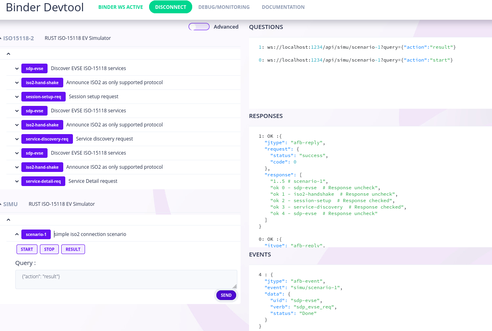

# injector-binding-rs inject RPC request into afb-v4 framework

This injector initial objective addresses ISO15118 and OCPP simulation for charger and/or electric vehicle. Nevertheless nothing is specific to EV/EVSE and it may test/simulate any API based on Afb-v4 framework.

The injector/simulator implement on api/verb per configure scenario. At the end of the test it return a normalized TAP response, that hopefully should integrated easily within any CI/CD model.

## Dependencies

https://github.com/redpesk-common/afb-librust

# configuration

Configuration relies on standard binding/binder json/yaml config file. The specific part dedicated to the injector.

The injector create a new verb per scenario. When executing a scenario use received an event per action. At the end of the test it may request scenario request that is then return as a TAP file.

Scenario metadata should define:
* uid: which define the api/verb to start/stop/check the execution
* info: a simple free comment
* target: the API to be tested. Depending on config, this might be local or remote API.

```yaml
    scenarios:
      - uid: scenario-1
        info: simple iso2 connection scenario
        target: iso2
        transactions:
```

Scenarion transactions should defined:
* uid: test name
* verb: injector call $target/$test (when not defined use UI to build verb name uid-sample will call uid_sample_req)
* delay: wait in ms before starting the test
* query: param value to be added to test/api/verb
* response: optional expected response (test only defined values). When not defined injector relies on RPC status to set OK/FX test result.

```yaml
        transactions:
        - uid: sdp-evse
          query:
            action: discover
        - uid: iso2-handshake
          verb: app_proto_req
```

Note: *scenario/start verb does not wait the end of the scenario to return. This because a scenario may last longueur than browser typical timeout.*

## starting the injector

Technically the injector is only "yet an other binding". The simplest way to start it is to add it configuration as the end of the binding to be tested.

Note: by default the API to be tested remain visible from "devtools", to remove it simply pass the binding to be tested in 'private' mode.

``` bash
afb-binder -v \
   --config=$ROOTDIR/iso15118-2/etc/binding-iso-2.yaml \
   --config=$CONFDIR/binding-simulator.yaml \
   $*
```



For further information on config: https://docs.redpesk.bzh/docs/en/master/developer-guides/resource-bindings.html#using-a-resource-binding-with-a-config

